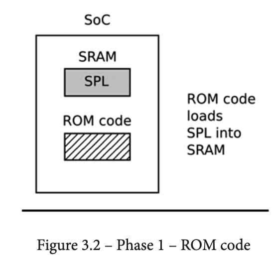
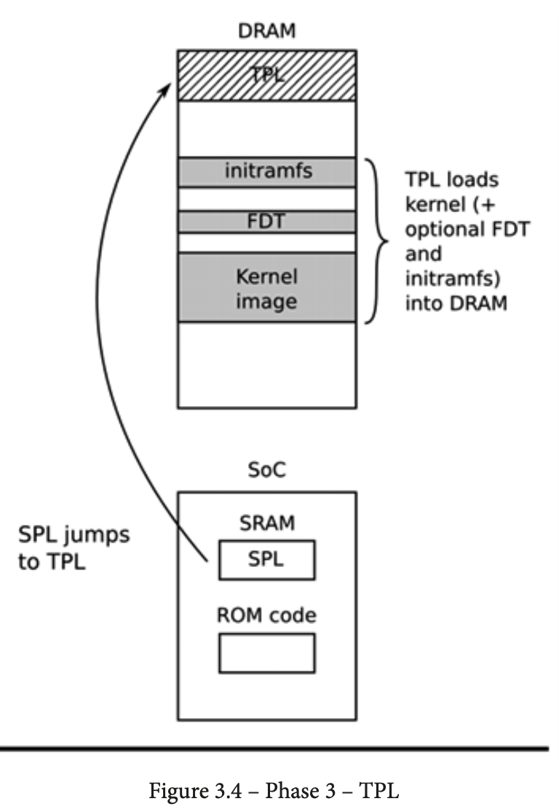

# Quá trình khởi động của một board chạy Linux

## Mục lục

- [Quá trình khởi động của một board chạy Linux](#quá-trình-khởi-động-của-một-board-chạy-linux)
	- [Mục lục](#mục-lục)
	- [Yêu cầu kiến thức](#yêu-cầu-kiến-thức)
	- [Từ khoá](#từ-khoá)
	- [Bootloader làm gì?](#bootloader-làm-gì)
	- [Quá trình hoạt động của bootloader](#quá-trình-hoạt-động-của-bootloader)
		- [Giai đoạn 1: ROM Code](#giai-đoạn-1-rom-code)
		- [Giai đoạn 2: Secondary Program Loader - SPL](#giai-đoạn-2-secondary-program-loader---spl)
		- [Giai đoạn 3: Tertiary Program Loader - TPL](#giai-đoạn-3-tertiary-program-loader---tpl)

## Yêu cầu kiến thức

## Từ khoá
- SRAM: RAM tĩnh, dung lượng bé (vài MB). Nằm bên trong vi xử lý
- DRAM: RAM động, có dung lượng lớn (từ vài chục MB tới vài GB). Nằm bên ngoài vi xử lý
- DRAM Controller: Một ngoại vi điều khiển DRAM giúp CPU đọc ghi dữ liệu tới DRAM.
- Kernel command line: dòng lệnh kernel
- SPL: Secondary Program Loader
- TPL: Tertiary Program Loader

## Bootloader làm gì?

**Bootloader** là một đoạn chương trình nhỏ, thường sẽ được chạy đầu tiên. Trong một hệ thống nhúng Linux, bootloader sẽ thực hiện **2 công việc chính**:

- Cấu hình, khởi tạo hệ thống (ở mức tối thiểu)
- Nạp kernel (thường là vào RAM)

Khi vừa cấp nguồn hoặc ngay sau khi nhấn nút RESET, hệ thống đang ở trạng thái tối giản nhất. DRAM Controller chưa được cấu hình, **nên không thể truy cập bộ nhớ DRAM**. Các ngoại vi khác (I2C, SPI, UART, SDMMC,...) cũng tương tự, nên không thể truy cập các loại bộ nhớ khác như thẻ SD, SPI Flash, EEPROM. Thường thì, tài nguyên khả dụng chỉ gồm 1 lõi CPU, RAM tĩnh (SRAM) và bộ nhớ FLASH nội (hoặc ROM code).

Quá trình khởi động hệ thống diễn ra qua nhiều giai đoạn. Bước cuối cùng của bootloader là **nạp kernel vào RAM và tạo môi trường khởi động cho nó**. Bootloader phải truyền cho kernel hai thông tin chính:

- Thông tin về cấu hình phần cứng (TODO: có thể là device tree)
- Dòng lệnh kernel (kernel command line)

Sau khi kernel khởi động, bootloader không còn cần thiết nữa, vùng nhớ nó sử dụng sẽ bị giải phóng.

## Quá trình hoạt động của bootloader

Quá trình khởi động của hệ thống trải qua 3 giai đoạn:

- Giai đoạn 1: ROM code
- Giai đoạn 2: SPL
- Giai đoạn 3: TPL

### Giai đoạn 1: ROM Code

Khi vừa khởi động hoặc nhấn nút RESET, một đoạn chương trình sẽ chạy. Đoạn chương trình này được lập trình trong quá trình sản xuất chip, được lưu trữ ở vùng nhớ ghi một lần (ROM) hoặc bộ nhớ FLASH nội, nên nó được gọi là **ROM code**. Nó có nhiệm vụ tìm kiếm và nạp **SPL** từ thẻ SD, bộ nhớ SPI Flash, NAND Flash, EEPROM I2C; hoặc thậm chí nạp qua giao tiếp UART, Ethernet hay USB.

ROM Code thường không khởi tạo DRAM Controller. Bộ nhớ RAM mà chương trình này sử dụng đến từ `SRAM`, là RAM nội bên trong con chip, kích thước rất bé (vài MB).

Ở cuối giai đoạn ROM code, SPL đã được nạp sẵn vào SRAM và chờ thực thi.

### Giai đoạn 2: Secondary Program Loader - SPL

CPU nhảy tới thực thi chương trình SPL đã nạp trong SRAM.

SPL là một đoạn chương trình lớn hơn ROM code, có thể thực hiện được nhiều tác vụ hơn. SPL phải khởi tạo DRAM Controller để truy cập được tới vùng nhớ DRAM lớn hơn nhiều so với SRAM. Nó cũng có thể đọc các chương trình TPL (có thể là **U-Boot**) nằm trong thẻ SD, bộ nhớ,... rồi nạp nó vào DRAM.

SPL thường không thể tương tác với người dùng. SPL được cung cấp sẵn từ hãng. Ở cuối giai đoạn này, TPL đã được nạp sẵn vào DRAM.

### Giai đoạn 3: Tertiary Program Loader - TPL

CPU nhảy tới thực thi chương trình TPL đã nạp trong DRAM.

Đây là bootloader hoàn chỉnh, ví dụ như U-boot. TPL có thể có giao diện dòng lệnh đơn giản để giao tiếp với nó. Ta có thể nạp Linux kernel, device tree, initramfs vào DRAM để chuẩn bị khởi động Linux.

Ở cuối giai đoạn này, TPL phải truyền cho kernel Linux một số thông tin:

- Machine number: dành cho lõi ARM cũ không hỗ trợ device tree
- Thông tin cơ bản về board, bao gồm kích thước và vị trí của RAM vật lý (DRAM) và tốc độ CPU.
- Kernel command line
- Device tree (tuỳ chọn)
- initramfs (tuỳ chọn)

